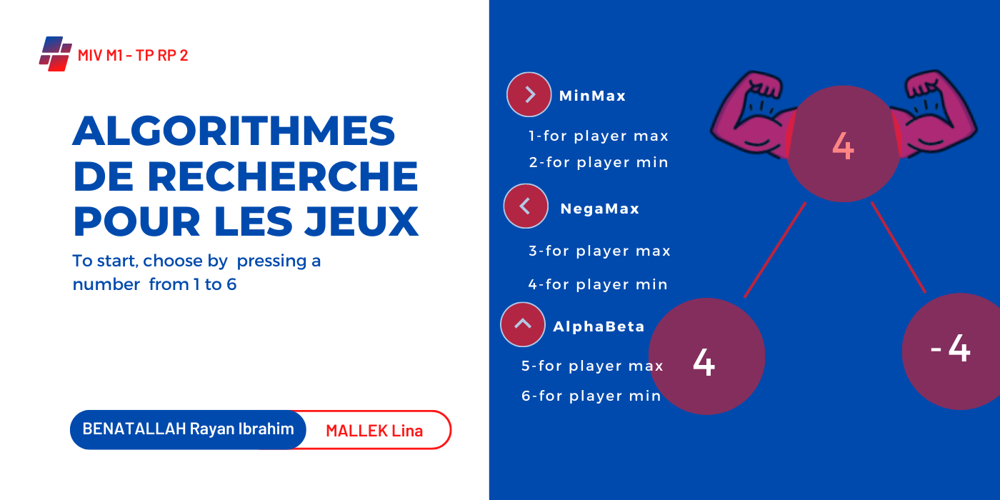

# MiniMax and NegaMax with Alpha-Beta Pruning

This Python project uses the `pygame` library to implement game tree search algorithms, including:
- MiniMax
- NegaMax
- Alpha-Beta Pruning

## Features
- User interface built with `pygame`.
- Depth-limited game tree initialization.
- Algorithms include:
  - MiniMax (Player Max and Min)
  - NegaMax
  - NegaMax with Alpha-Beta Pruning

## Requirements
- Python 3.x
- `pygame` library

Install `pygame` using:

```bash
pip install pygame
```
 
